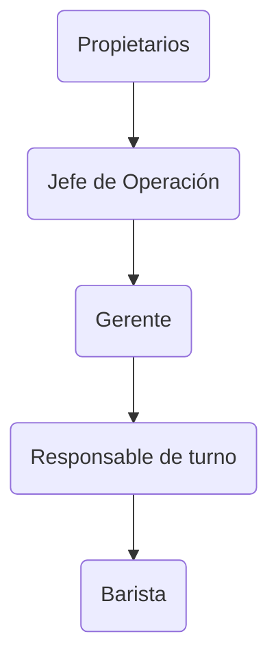

# 2.1 MANUAL DE CONDUCTA, OPERACIÓN Y DISCIPLINA INTERNA

---

## 1. OBJETIVO

Establecer los lineamientos de conducta, operación, disciplina, seguridad, higiene, presentación personal y desempeño profesional que deberán observar todas las personas colaboradoras.

El presente Manual forma parte integrante de la documentación laboral de la empresa y complementa el Contrato Individual de Trabajo, los Manuales Operativos y las políticas internas.

---

## 2. MISIÓN DEL COLABORADOR

Todo colaborador deberá contribuir a:

* La satisfacción del cliente.  
* La calidad del producto.  
* La seguridad alimentaria.  
* El cuidado de los activos de la empresa.  
* La conservación de la imagen y prestigio de la marca.  
* El cumplimiento de los objetivos comerciales y operativos.

---

## 3. VALORES DE LA EMPRESA

#### Profesionalismo

Realizar las actividades asignadas con responsabilidad y excelencia.

#### Respeto

Mantener una convivencia sana entre colaboradores, clientes y proveedores.

#### Honestidad

Actuar con integridad en el manejo de dinero, insumos y recursos.

#### Disciplina

Cumplir procedimientos, horarios y lineamientos establecidos.

#### Sentido de urgencia

Atender las necesidades operativas de manera eficiente.

---

## 4. CADENA DE MANDO

La estructura organizacional oficial será:

**Equivalencias de nomenclatura.** Para evitar confusiones, a lo largo de este manual los siguientes términos se refieren al mismo rol:

| Rol oficial | Términos equivalentes usados en el manual |
| ----- | ----- |
| Jefe de Operación | Dirección Operativa, Director Operativo |
| Responsable de turno | Supervisor, Encargado |
| Barista | (incluye las funciones de cobro; no existe un puesto separado de "cajero") |

Todo colaborador deberá respetar la cadena de mando.

Las instrucciones emitidas por:

* Jefe directo.  
* Jefe de Operación.  
* Propietarios.

deberán ser atendidas de forma inmediata siempre que sean compatibles con las funciones laborales asignadas.

---

## 5. Conducta y Respeto

!!! danger "Queda prohibido"
    - Insultar o amenazar a compañeros, superiores o clientes.
    - Hostigar, acosar o discriminar.

!!! warning "Tampoco se permite"
    - Forzar conversaciones que incomoden a compañeros.
    - Insistir en temas políticos, religiosos o personales.
    - Generar discusiones innecesarias.

---

## 6. RESPETO A LA PROPIEDAD AJENA

Ningún colaborador podrá:

* Tomar dinero ajeno.  
* Tomar herramientas ajenas.  
* Tomar objetos personales ajenos.  
* Utilizar pertenencias de otros colaboradores.

sin autorización previa.

---

## 7. RELACIÓN CON CLIENTES

Todo cliente deberá recibir:

* Trato cordial.  
* Atención profesional.  
* Respeto.

Queda prohibido:

* Discutir con clientes.  
* Gritar a clientes.  
* Burlarse de clientes.  
* Utilizar lenguaje ofensivo.

---

## 8. PRESENTACIÓN PERSONAL

Los colaboradores deberán presentarse:

* Limpios.  
* Aseados.  
* Uniformados.

---

## 9. Uniforme Obligatorio

!!! danger "Prohibido en el uniforme"
    **Calzado:** chanclas · sandalias · huaraches · calzado abierto.

    **Prendas inferiores:** shorts · bermudas · faldas · vestidos.

    **Prendas superiores:** tirantes · playeras sin mangas · prendas que expongan hombros · transparencias.

---

## 10. Higiene Personal

| Aspecto | Estándar |
| ----- | ----- |
| Cabello | Recogido si es largo |
| Barba | Limpia y arreglada |
| Uñas | Cortas, limpias, sin esmalte |

---

## 11. SEGURIDAD ALIMENTARIA

Todo colaborador deberá:

* Mantener superficies limpias.  
* Lavar utensilios oportunamente.  
* Mantener estaciones ordenadas.  
* Seguir protocolos de inocuidad.

---

## 12. LIMPIEZA OPERATIVA

Durante toda la jornada se deberá:

* Limpiar mesas.  
* Limpiar barra.  
* Limpiar equipo.  
* Lavar loza.  
* Mantener áreas despejadas.

---

## 13. PUNTUALIDAD

Se concede una tolerancia de:

#### 15 minutos

Después de ese periodo se registrará un retardo.

#### 5 retardos

Equivalen a una falta leve, conforme a la clasificación única del apartado 2.2 (Clasificación de Faltas y Medidas Disciplinarias).

---

## 14. AUSENCIAS

Toda ausencia deberá notificarse:

* Al jefe directo.  
* Al Jefe de Operación.

tan pronto como sea posible.

---

## 15. HORARIOS

Ningún colaborador podrá modificar:

* Turnos.  
* Horarios.  
* Descansos.

sin autorización.

---

## 16. ALCOHOL Y DROGAS

Queda prohibido:

* Presentarse intoxicado.  
* Consumir alcohol durante la jornada.  
* Consumir drogas.  
* Permitir consumo no autorizado de alcohol por clientes.

---

## 17. USO DE REDES SOCIALES

Ningún colaborador podrá:

* Hablar oficialmente por la marca.  
* Publicar información interna.  
* Divulgar conflictos internos.

sin autorización.

---

## 18. CONFIDENCIALIDAD

Se considera información confidencial:

* Recetas.  
* Fichas técnicas.  
* Curvas de tostado.  
* Costos.  
* Proveedores.  
* Clientes.  
* Estrategias comerciales.  
* Información financiera.

La obligación continúa incluso después de terminar la relación laboral.

---

## 19. INVENTARIOS Y MERMAS

Todo colaborador deberá:

* Reportar faltantes.  
* Reportar mermas.  
* Reportar daños.  
* Reportar robos.

de forma inmediata.

---

## 20. DESCRIPCIÓN DE PUESTO: BARISTA

#### Responsabilidades

1. Cumplir checklist.  
2. Registrar asistencia.  
3. Cobro correcto de cuentas.  
4. Preparación de bebidas.  
5. Preparación de alimentos asignados.  
6. Control de estación.  
7. Mise en place.  
8. Supervisión de limpieza.  
9. Conocimiento de ingredientes.  
10. Cuidado de imagen del establecimiento.  
11. Entrega de turno.  
12. Reporte de incidencias.  
13. Reporte de inventarios.  
14. Reporte de mermas.

---

## 21. MEDIDAS DISCIPLINARIAS

Las faltas se clasifican y sancionan conforme a una **única** taxonomía —**Leve, Grave y Muy Grave**— definida en el apartado 2.2 (Clasificación de Faltas y Medidas Disciplinarias). Ese apartado es la referencia oficial; este manual no maneja escalas paralelas.

Las medidas disponibles, aplicadas de forma progresiva y proporcional según la gravedad, son:

1. Amonestación verbal.  
2. Amonestación escrita.  
3. Acta administrativa.  
4. Suspensión temporal conforme a la Ley Federal del Trabajo, cuando proceda.  
5. Rescisión de la relación laboral cuando legalmente proceda.

---

## 22. ACUSE DE RECIBIDO

Al final debe existir una hoja independiente con:

* Nombre del colaborador.  
* Puesto.  
* Fecha.  
* Firma.
